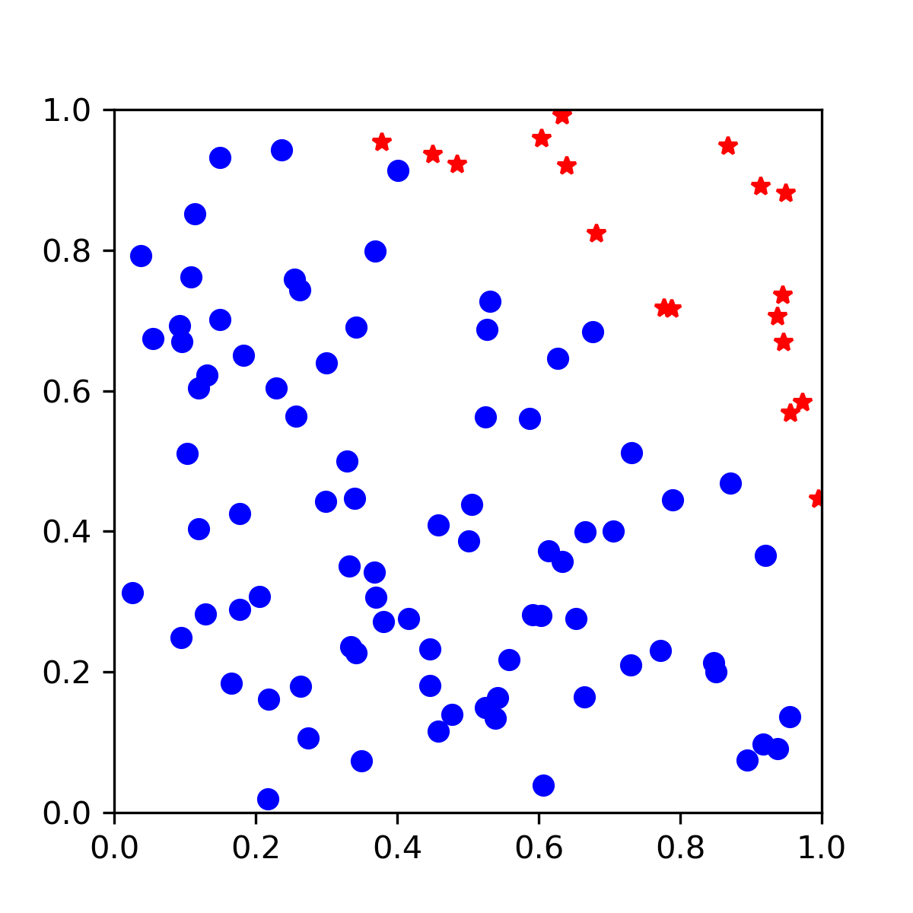
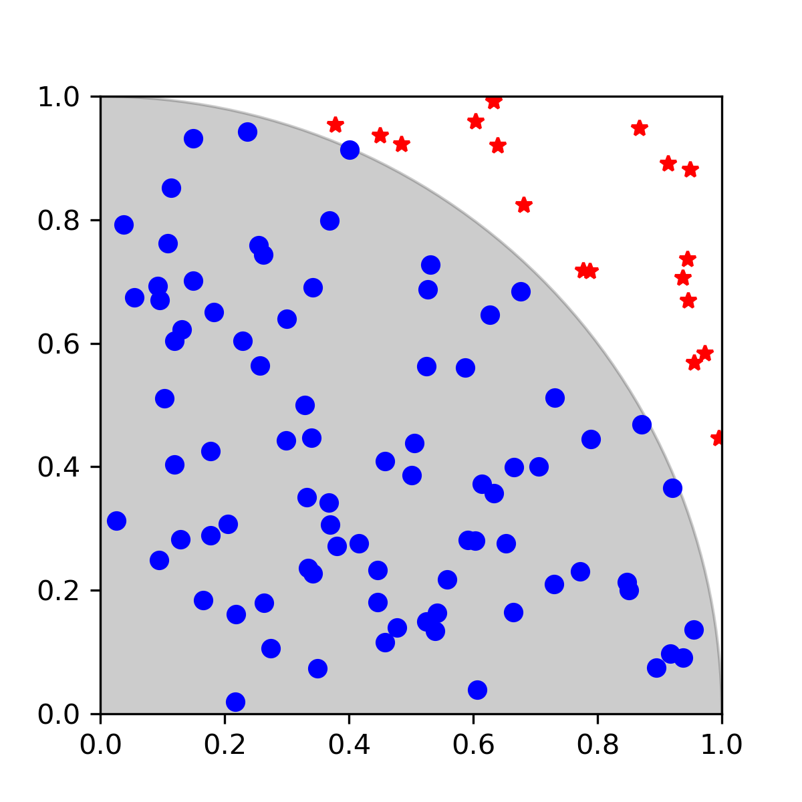
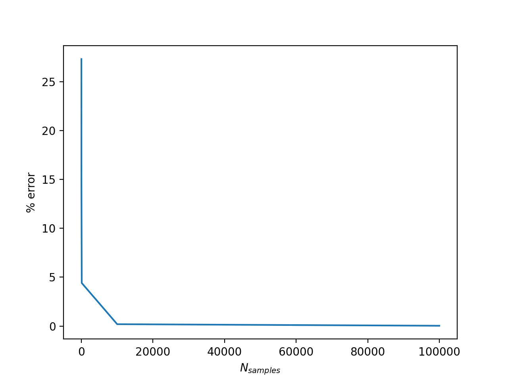
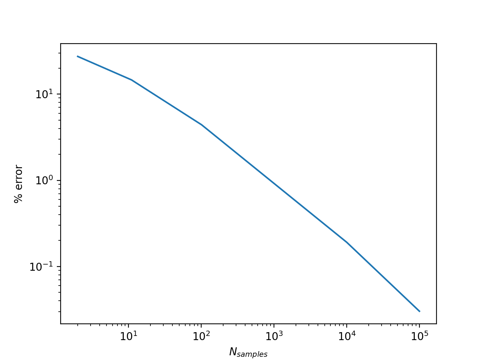

# Day 2 Topics

 
  

# Introduction

 
   

This module will cover calculating pi using Monte Carlo integration. For this module, as well as for the initial Monte Carlo code, we will use only libraries and functions which are part of the [Python Standard Library](https://docs.python.org/3/library/). The Python Standard Library is the set of modules and functions that are distributed with Python. We will use Matplotlib (not part of Python standard library) for visualization.

Later in the course, we will also see how we can perform the calculations more quickly by utilizing the Python library NumPy.

# Calculation of $$\pi$$ using MC Integration

In this lesson, we will be using Monte Carlo integration to estimate the value of $$\pi$$. Monte Carlo techniques depend on the generation of random numbers.

We calculate $$\pi$$ using random numbers and the unit circle. We will generate $$N$$ random $$(x, y)$$ points with x and y values between zero and one. This corresponds to points in the first quadrant of a Cartesian coordinate system. We start with a counter equal to zero. If a randomly generated point lies inside of the unit circle, we will increase our counter by one. After $$N$$ random numbers are generated, we can estimate the area of one quarter of the unit circle:

$$A_{curve} = \frac{N_{accept}}{N_{trial}} * A_{tested} $$

We will see a more mathematically rigorous explanation for this formula later. In our case, the tested area, $$A_{tested}$$ is equal to 1, so the estimate of the area is simply the ratio of points inside the circle to the total number of points. 

The area of a circle is related to $$\pi$$ by $$A_{circle} = \pi*r^{2}$$, meaning that for the unit circle, the total area is equal to $$\pi$$.

Therefore, we can estimate the value of $$\pi$$ for our points by multiplying our calculated area by 4 (since our points will all be in the first quadrant)

$$ \pi \approx  4 * \frac{N_{accept}}{N_{trial}} $$

# Writing our MC code

To generate our random points, we will use the Python module [`random`](https://docs.python.org/3/library/random.html). The `random` library has functions related to random number generation.

We will also be using Python's built in [`math`](https://docs.python.org/3/library/math.html) module for operations like raising numbers to powers and accessing a reference value for pi.

First import the libraries:

~~~
import random
import math
~~~
{: .language-python}

We will begin our calculation with 100 randomly generated points. We define a variable called `n_samples` to contain this information. 

~~~
n_samples = 100
~~~
{: .language-python}

Next, we start a counter (`num_inside`) for keeping track of how many points have fallen inside our unit circle.

~~~
num_inside = 0
~~~
{: .language-python}

To generate `n_samples` points, we use a `for` with the range function.

~~~
for i in range(n_samples):
    print(i)
~~~
{: .language-python}

As a reminder, this `for` loop will print all numbers from `0` to `99`. In this `for` loop, we don't really care about the value of `i`, we are just using it to make sure the operation is done 100 times. For each loop iteration we need to 

1. Generate a random x point on the range 0 to 1
1. Generate a random y point on the range 0 to 1
1. Calculate the associated value ($$x^2 + y^2$$). If the value is less than 1, increase `num_inside` by 1.

~~~
n_samples = 100

num_inside = 0

for i in range(n_samples):

    # Generate a random point between 0 and 1 for x.
    x = random.random()

    # Generate a random point between 0 and 1 for y.
    y = random.random()

    # Calculate the radius of this point
    r = math.sqrt(x ** 2 + y ** 2)

    if r < 1:
        num_inside += 1
~~~
{: .language-python}

After running this code, we can get a guess for the value of $$\pi$$.

~~~
# Calculate pi
4 * num_inside / n_samples
~~~
{: .language-python}

~~~
3.24
~~~
{: .output}

Your number will vary based on the random numbers which were generated. You will get a slightly different value for each calculation.

# Visualization

To get a better idea of what's going on, we can add visualization using the Python library matplotlib. Matplotlib is not part of the Python standard library, but is widely used for data visualization.

To use the matplotlib library, add the following import to your notebook. The second command in this code block `%matplotlib notebook` is a special command for using matplotlib in the Jupyter notebook which makes plots interative.

~~~
import matplotlib.pyplot as plt

%matplotlib notebook
~~~
{: .language-python}

We next create an empty figure using the `plt.figure` command. We then add an axis to this figure. Capturing the output of these commands as variables will allow us to continue to manipulate the figure.

~~~
fig = plt.figure(figsize=(4,4))
ax = fig.add_subplot(111)
fig.show()
~~~
{: .language-python}

Next, modify the loop where you calculated pi to add points to this plot when they are generated. We will modify this so that accepted points (points inside the circle) are plotted with blue circles while points outside of the unit circle are plotted with red stars. After the points are generated, we constrain the limits of the x and y axes.

~~~
# This time add points to plot as they're calculated.

# Start by using 100 samples.
n_samples = 100

num_inside = 0
for i in range(n_samples):
    # Generate a random point between 0 and 1 for x.
    x = random.random()
    
    # Generate a random point between 0 and 1 for y.
    y = random.random()
    
    ## Calculate the radius of this point.
    r = math.sqrt(x ** 2 + y ** 2)
    
    # if this value is less than 1, the point is inside the circle.
    if r < 1:
        num_inside += 1
        # if inside add to plot
        ax.plot(x, y, 'ob')
    else:
        ax.plot(x, y, 'r*')

ax.set_xlim(0, 1)
ax.set_ylim(0, 1)
~~~
{: .language-python}

An example output is shown below:

## Improving the visualization

We can add a circle to our visualization so that we can see the boundary of the unit circle
~~~
# Use patch in matplotlib to make a circle for better visualization

from matplotlib.patches import Circle

circle = Circle((0, 0), 1, color='k', alpha=0.2)
ax.add_patch(circle)
fig.show()
~~~
{: .language-python}

# Pi for increasing number of samples

Let's examine how the calculated value of $$\pi$$ changes with increasing number of samples. We will increase our number of samples to 100,000. 

We are also modifying our code so that the value of $$\pi$$ will be stored for every power of 10. We do this by adding `math.log(n, 10)`. This will give us the number 10 must be raised to to be equal to `n`. For example, `math.log(100, 10)` would be equal to 2. If the number returned from this is an integer (ie, the modulus of the number with 1 is zero), we store the calculated value of $$\pi$$.

~~~
n_samples = 100000

# Empty lists for appending.
calculated_pi = []
n_values = []
num_inside = 0

for n in range(1, n_samples+1):
    # Generate a random point between 0 and 1 for x.
    x = random.random()

    # Generate a random point between 0 and 1 for y.
    y = random.random()

    ## Calculate the radius of this point.
    r = math.sqrt(x ** 2 + y ** 2)

    # if this value is less than 1, the point is inside the circle.
    if r < 1:
        num_inside += 1

    log10 = math.log(n, 10)

    if log10 % 1 == 0:
        calculated_pi.append(4*num_inside/n)
        n_values.append(n+1)

        print(f'{n}\t{calculated_pi[-1]}')
~~~
{: .language-python}

~~~
1	4.0
10	3.6
100	3.28
10000	3.1476
100000	3.14064
~~~
{: .output}

Remember that your values will be different because this is based on random numbers.

# Examining error

> ## Exercise
> Calculate the percent error for each value of $$\pi$$. You can use `math.pi` as a reference value and `math.fabs` to get an absolute value.
>> ## Solution
>> ~~~
>> error = []
>> for i in range(len(calculated_pi)):
>>     percent_error = 100 * (math.fabs(math.pi - calculated_pi[i]))/(math.pi)
>>     error.append(percent_error)
>> ~~~
>> {: .language-python}
> {: .solution}
{: .challenge}

Plot the error
~~~
fig = plt.figure()
ax = fig.add_subplot(111)
ax.plot(n_values, error)
plt.xlabel('$N_{samples}$')
plt.ylabel('% error')
~~~
{: .language-python}

When we plot this on a log-log plot, our results should look roughly linear. The error of a MC integration scales with $$1/\sqrt{N}$$.
~~~
fig = plt.figure()
ax = fig.add_subplot(111)
ax.semilogx(n_samples, error)
~~~
{: .language-python}

## Monte Carlo in more detail
Monte Carlo methods are numerical techniques
frequently used to estimate complex multidimensional integrals which otherwise could not be performed. The idea of Monte Carlo integration is to estimate the value of an integral by generating random points from the probability density.

For instance, the integral of the function $$f(\textbf{x})$$, where $$\textbf{x} \in \Re^{M}$$, is approximated as
 \begin{equation}
	 I = \int_V f(\textbf{x}) \, d\textbf{x} = \int_V
	 \frac{f(\textbf{x})}{h(\textbf{x})} h(\textbf{x}) \, d\textbf{x} 
	 = \left< \frac{f(\textbf{x})}{h(\textbf{x})} \right>_{h(\textbf{x})}
	 \label{eq.averageGeneral}
 \end{equation}

 The idea of Monte Carlo integration is to estimate the expectation value by
 generating random samples of $$\textbf{x}$$ from the probability density $$h(\textbf{x})$$. 

### Uniform Probability Density
We are free to chose the probability
distribution
$$h(\textbf{x})$$. The simplest case is to uniformly generate $$\textbf{x}$$
in the volume ($$V$$). In this way, $$h(\textbf{x})$$ becomes constant as
\begin{equation}
	h(\textbf{x}) = \frac{1}{V}
	\label{eq.uniformDist}
\end{equation}
Using this sampling density $$h(\textbf{x})$$, the integral becomes
\begin{equation}
	I = \int_V f(\textbf{x}) \, d\textbf{x} \approx \frac{V}{N} \sum_{i=1}^N
	f(\textbf{x}_i)
	\label{eq.averageUniform}
\end{equation}
where N is the total number of random samples and $$f(\textbf{x}_i)$$ is the
integrand evaluated using the $$i^{th}$$ sample.

