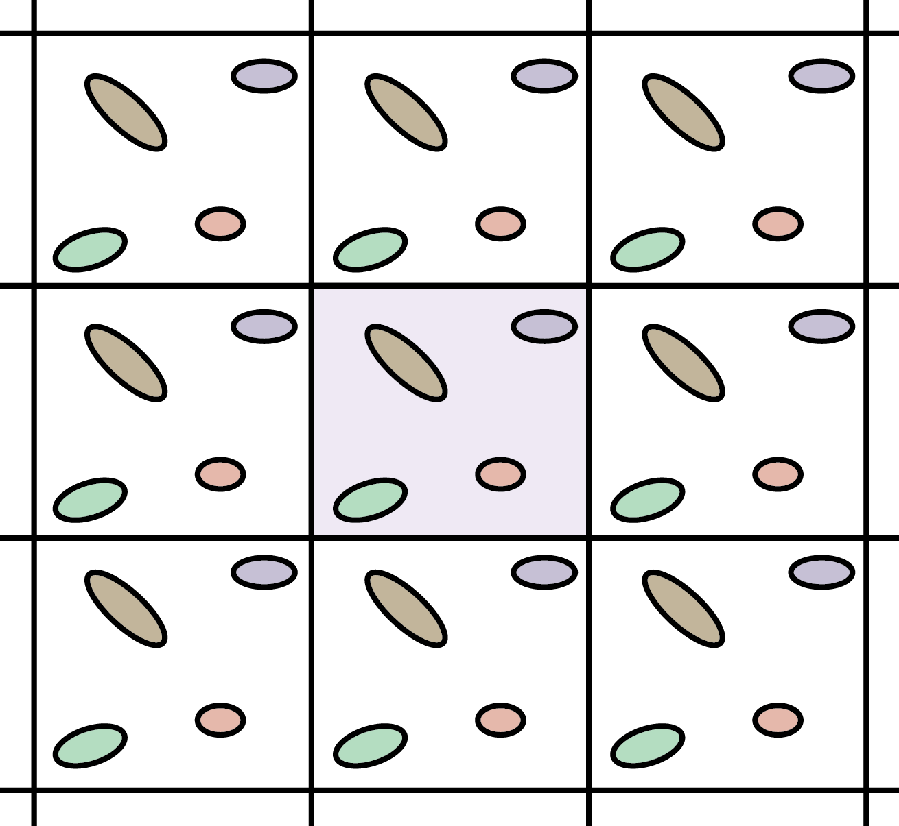

## Group Blog
Read the information in this section and take 15 minutes or so to discuss as a group. Discussion of periodic boundaries and cutoffs should be included in your daily blog.

## Discussion
Tomorrow, we will write the Monte Carlo loop for our simulation. 
In order to make the simulation run in a somewhat reasonable amount of time, we will have to use a few computational tricks. 
Those tricks are the use of simulation cut-offs and periodic boundaries. 

We will also be implementing these before writing our Monte Carlo loop to confirm that our program is calculating the energy correctly. 
For this homework, you will add the "computational tricks" to your code and confirm that your calculated energy matches that given by NIST.

This page gives a short explanation of each concept. 
For a more in-depth explanation read the section "3.2.2 Technical Details" from Chapter 2 of the book ["Understanding Molecular Simulation"](https://www-sciencedirect-com.libproxy.berkeley.edu/book/9780122673511/understanding-molecular-simulation), which is available as an e-book for UC Berkeley's library.

### Cutoffs
In molecular simulations, use of a **cut-off distance** is usually employed. 
The idea is that if particles are beyond a certain distance from one another, the force between them is assumed to be negligible and the force is not calculated. 
**Discussion Questions** 

1. Consider a system of 10 particles. How many pairwise particle-particle interactions will there be? What about 100 or 1000 particles? Consider a system with a density of 1. Using this density, how many particles are in a sphere with radius 1, 2, 5, and 10 units? (These are math problems, you don't have to use programming to solve them, but you can.)

1. Can you think of the benefits associated with using a cut-off? 
What are the risks?

### Periodic Boundaries
Modern molecular simulations can be carried out with up to millions of particles.
This number of particles is still far away of being representative of a bulk liquid. 
To get around this problem, we employ a trick called periodic boundary conditions. 
The primary simulation box is surrounded by copy images of itself. 
See the diagram below for a 2D cartoon representation:

<figure class="figure">

<figcaption class='figure-caption'>
A schematic representation of periodic boundary conditions. 
The unit cell of system is in the center cell (pink). 
The potential energy of the system includes interactions between this center cell and its periodic images. Image Credit Christopher Rowley, obtained from <a href="https://commons.wikimedia.org/wiki/File:Periodic_Boundary_Conditions_in_2D.png">Wikimedia Commons.</a>
</figcaption> 
</figure>  

For a cubic simulation (3 dimensional), there would be 26 images around the central box. 
This trick has two implications:

1. If the position of a particle (i.e. Cartesian coordinates) is outside the simulation box after a particle translation, an identical particle should enter the box through the opposite face of the box.
1. When measuring distances used in the evaluation of the LJ potential, we should measure the minimum image.

To get a better idea of periodic boundaries, consider two particles in a periodic box with a length of 10 $$\sigma$$ (remember that when we used reduced units, our units of length are $$\sigma$$). 
One particle is at `(0, 0, 0)`, and the second is at `(0, 0, 8)`. If we were to measure the distance between these two particles using our `calculate_distance` function, that distance would be 8 $$\sigma$$. 
However, because we are using periodic boundary conditions, that is not the distance between the particles. 
There is another copy, or image, of the particle in the adjacent periodic boxes. 
If you have ever played the game Pac-Man, it is a very similar idea to how the characters in this game behave. 
If they exit through one side of the box, they reappear on the other.

Consider the following questions:

1. What is the maximum distance any particle can be from another in each dimension? (this will have to do with the box length)
1. What is the actual distance of our example? (`(0, 0, 0)`, `(0, 0, 8)`)

