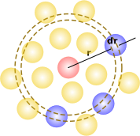

## Discussion - Radial Distribution Function

## Performance
What algorithmic decision did we make when writing our Monte Carlo simulation loop that affected the performance? 
How many fewer computations does this result in as a function of number of particles?

## Analysis
Often when analyzing molecular simulation functions, we will analyze the structure of molecules or atoms using something called a **radial distribution function**, or RDF. The RDF describes local structure of particles. 

For example, consider a particle at the origin. To calculate RDF, you consider a distance, r, and a distance interval, dr. You count how many particles are a distance of r + dr from the particle of interest, as illustrated in the figure:

A sample radial distribution function for a fluid is shown below. A peak indicates a higher probability of particles being located at that distance. This graph shows that particles in a fluid will have neighboring particles (the peak), and then the RDF will flatten out to a constant value. The radial distribution function is typically normalized so that this value is equal to 1 (as shown in the plot below).

**Discussion** - Read [this webpage](https://en.wikibooks.org/wiki/Molecular_Simulation/Radial_Distribution_Functions) and [this webpage](http://www.physics.emory.edu/faculty/weeks/idl/gofr.html) on radial distribution functions for more explanation. Why are different shapes observed for solids, liquids, and gases? Consider the formula for RDF. Why does the radial distribution function converge to one for liquids and gases? 

In a molecular simulation, you will typically calculate the RDF for each individual frame, then averaged. Can you think of a reason why this would be the case?

